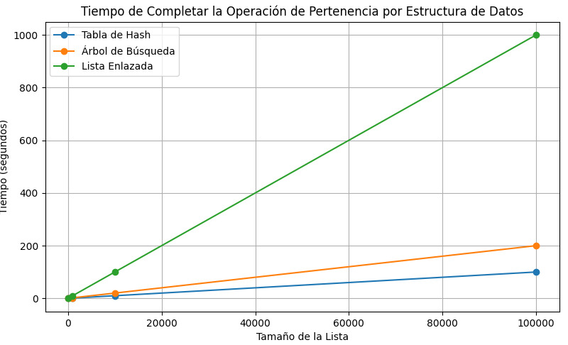

<div align="right">

</div>

# TDA HASH

## Repositorio de (Nombre Apellido) - (Padrón) - (Mail)

- Para compilar:

```bash
línea de compilación
```

- Para ejecutar:

```bash
línea de ejecución
```

- Para ejecutar con valgrind:
```bash
línea con valgrind
```
---
##  Funcionamiento

Explicación de cómo funcionan las estructuras desarrolladas en el TP y el funcionamiento general del mismo.

Aclarar en esta parte todas las decisiones que se tomaron al realizar el TP, cosas que no se aclaren en el enunciado, fragmentos de código que necesiten explicación extra, etc.

Incluír **EN TODOS LOS TPS** los diagramas relevantes al problema (mayormente diagramas de memoria para explicar las estructuras, pero se pueden utilizar otros diagramas si es necesario).

### Por ejemplo:

El programa funciona abriendo el archivo pasado como parámetro y leyendolo línea por línea. Por cada línea crea un registro e intenta agregarlo al vector. La función de lectura intenta leer todo el archivo o hasta encontrar el primer error. Devuelve un vector con todos los registros creados.

<div align="center">

</div>

En el archivo `sarasa.c` la función `funcion1` utiliza `realloc` para agrandar la zona de memoria utilizada para conquistar el mundo. El resultado de `realloc` lo guardo en una variable auxiliar para no perder el puntero original en caso de error:

```c
int *vector = realloc(vector_original, (n+1)*sizeof(int));

if(vector == NULL)
    return -1;
vector_original = vector;
```


<div align="center">

</div>

---

## Respuestas a las preguntas teóricas

### Definición de Diccionario:

Un diccionario es como una caja de herramientas donde guardas cosas relacionadas entre sí. Cada cosa tiene su propio nombre y puedes sacarla fácilmente si conoces su nombre. En términos más técnicos, es una estructura de datos que almacena pares de elementos: una clave (key) y un valor asociado (value). La clave es como el nombre de la cosa que quieres guardar, y el valor es la cosa misma. Con un diccionario, puedes guardar, recuperar y actualizar información de manera rápida usando estas claves. Es una forma muy útil de organizar y acceder a datos en la programación.

### Formas de Implementar un Diccionario:

1. **Tabla de Hash**:

   Una tabla de hash es como una lista grande donde guardamos cosas en posiciones específicas usando una clave.

   - **Hashing**: Imagina que tenemos una fórmula mágica (función de hash) que convierte la clave en un número que usamos como índice en la lista.
   - **Colisiones**: A veces, dos claves pueden terminar en el mismo lugar (colisión). Para manejar esto, podemos usar una lista en ese lugar o buscar el siguiente hueco libre.

   **Pros**:
   - Encontrar, agregar o borrar algo es súper rápido, normalmente toma el mismo tiempo sin importar cuántos elementos haya.
   - Perfecta si quieres velocidad.

   **Contras**:
   - Necesitas una buena fórmula mágica (función de hash).
   - Puede usar más memoria porque necesitas espacio extra para manejar colisiones.

2. **Árbol de Búsqueda Binario Balanceado (AVL)**:

   Un árbol de búsqueda binario balanceado es como un árbol donde cada nodo guarda una clave y un valor, y el árbol se autoorganiza para mantener el equilibrio.

   - **Estructura del Árbol**: Cada nodo tiene dos hijos, uno a la izquierda y otro a la derecha. Las claves a la izquierda son más pequeñas y las de la derecha más grandes.
   - **Balanceo**: El árbol se ajusta solo para no estar desbalanceado y asegurar que encontrar cosas no se vuelva lento.

   **Pros**:
   - Encontrar, agregar o borrar algo toma un tiempo razonable que crece lentamente a medida que agregas más elementos.
   - No necesitas una función de hash.

   **Contras**:
   - Más complicado de programar que una tabla de hash.
   - Puede ser un poco más lento que una tabla de hash en algunos casos.

3. **Lista Enlazada**:

   Una lista enlazada es simplemente una lista donde cada elemento apunta al siguiente.

   - **Estructura de Lista**: Cada elemento tiene una clave y un valor, y para encontrar algo tienes que empezar desde el principio y buscar hasta encontrar la clave.
   - **Inserción**: Puedes agregar elementos al principio o al final de la lista.

   **Pros**:
   - Muy fácil de programar y entender.
   - No tienes que preocuparte por colisiones ni balanceo.

   **Contras**:
   - Encontrar, agregar o borrar algo puede ser lento porque tienes que buscar a través de toda la lista.
   - No es buena para listas largas o cuando necesitas velocidad.

<div style="text-align: center;">
    
</div>

## Explicación y Reseña del Gráfico:

Para analizar el rendimiento de diferentes estructuras de datos en la operación de pertenencia, se empleó Python para implementar un programa que mide el tiempo requerido para completar esta operación en tres estructuras distintas: tabla de hash, árbol de búsqueda binario balanceado y lista enlazada. Estas implementaciones se sometieron a pruebas con diferentes tamaños de datos para evaluar su desempeño en escenarios variados.

Tras recopilar los datos de rendimiento, se generó un gráfico utilizando la biblioteca de visualización de datos Matplotlib en Python. Este gráfico ofrece una representación visual clara de cómo varía el tiempo de completar la operación de pertenencia en función del tamaño de la lista para cada una de las tres estructuras de datos.

**Reseña del Gráfico:**

El gráfico exhibe el tiempo necesario para completar la operación de pertenencia en relación con el tamaño de la lista para tres estructuras de datos distintas: tabla de hash, árbol de búsqueda binario balanceado y lista enlazada. Cada línea en el gráfico corresponde a una estructura de datos, mientras que el eje x representa el tamaño de la lista y el eje y representa el tiempo en segundos.

**Conclusión:**

Al analizar el gráfico, se pueden extraer diversas conclusiones:

1. La tabla de hash presenta un tiempo de búsqueda constante, independientemente del tamaño de la lista. Esto sugiere que la búsqueda en una tabla de hash es altamente eficiente y apenas se ve afectada por el tamaño de los datos.
2. El árbol de búsqueda binario balanceado muestra un tiempo de búsqueda que aumenta de forma logarítmica con el tamaño de la lista. Aunque es más lento que la tabla de hash para listas pequeñas, su tiempo de búsqueda se mantiene razonable incluso para listas más grandes.
3. La lista enlazada exhibe un tiempo de búsqueda que crece linealmente con el tamaño de la lista. Este comportamiento indica que la búsqueda en una lista enlazada se vuelve considerablemente más lenta a medida que aumenta el tamaño de los datos.

En resumen, el gráfico resalta cómo diferentes estructuras de datos pueden influir en el rendimiento de las operaciones de búsqueda según el tamaño de los datos. La elección de la estructura de datos adecuada puede tener un impacto significativo en el rendimiento de una aplicación, especialmente cuando se manejan grandes volúmenes de datos.

# Qué es una función de hash y qué características debe tener

Una función de hash es como una especie de receta secreta en la cocina. Toma algo, como una palabra o un número, y lo transforma en un código único. Es como si mezclaras ingredientes para hacer una receta especial: cada combinación de ingredientes produce un plato único.

Para ser efectiva, una función de hash debe tener algunas características importantes:

1. **Determinística**: Esto significa que siempre que le des la misma entrada, obtendrás la misma salida. Por ejemplo, si le das la palabra "perro" a la función de hash, siempre debería darte el mismo código único.

2. **Eficiente**: La función de hash debe ser rápida de calcular. No quieres esperar mucho tiempo para obtener el código único de algo.

3. **Distribución uniforme**: Esto significa que la función de hash debería producir códigos únicos que se distribuyan de manera uniforme en el espacio de salida. No quieres que muchos elementos diferentes terminen con el mismo código único.

4. **Resistencia a colisiones**: Una colisión ocurre cuando dos entradas diferentes producen el mismo código único. Si bien es difícil evitar por completo las colisiones, una buena función de hash debería minimizar la probabilidad de que ocurran. Esto es importante para evitar confusiones y mantener la integridad de los datos.


